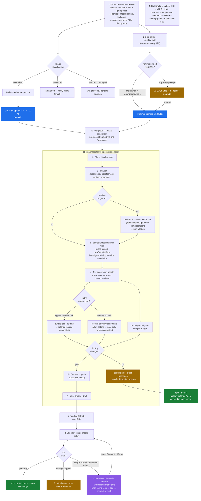

# How the update system works

Every "update" the dashboard performs flows through one pipeline (`createUpdatePR`)
with three trigger families and two autonomous loops around it. The diagram below
renders on GitHub, in VS Code (Mermaid preview), or at <https://mermaid.live>.

## The aspects, one by one

**1. Scan → model.** On load / Refresh, `lib/github.js#buildModel` pulls the org's
open Dependabot alerts (paginated) and `gh repo list`, joining them into a per-repo
model: severity counts, flagged packages (with patched targets + GHSA), ecosystems,
open tool-PRs, the published/depends-on dependency graph, classification, and contact.

**2. Triage.** Each repo is **Maintained** (we patch), **Monitored** (inactive client
— we email a notice, no code change), **Ignored**, or **Untriaged**. Only Maintained
repos auto-update / auto-upgrade; the rest are manual.

**3. Triggers into the job queue.**
- **Manual:** `Create update PR` (one repo) or `⚡ Open update PRs for all` (fan-out).
- **EOL auto-upgrade** (poller): a *maintained* repo pinned to an end-of-life runtime →
  a runtime-upgrade job. Any in-scope repo shows a ⚠ badge + manual `⬆ Propose upgrade`.

**4. Job queue + event stream.** All update/upgrade jobs ride one queue capped at 3
concurrent (the heavy work is spawned `gh`/`git`/`bundle`/`npm` child processes, so
they run truly in parallel). Progress fans out over a single `/api/events` NDJSON
stream — survives reload, no per-job connection limit.

**5. The `createUpdatePR` pipeline** (`lib/updater.js`): clone → branch → *(upgrade
only)* `writePins` rewrites the EOL version pin → **bootstrap** installs the repo's
pinned Ruby/Node/Go/PHP via mise (behind an install gate that dedups identical
versions and serializes, so concurrent jobs never corrupt a shared compile) →
per-ecosystem update run **through `mise exec`** so the pinned runtime is used →
check for changes → commit → push → open a **draft** PR.

**6. App vs. library (the Ruby split).** An **app** (committed `Gemfile.lock`) gets the
lockfile bumped to patched versions and committed. A **gem** (gemspec, no lockfile)
is *not* given a committed lockfile — instead we resolve to verify whether its
constraints already permit the patched versions (they usually do — the fix lands in
consuming apps) and only flag a constraint that actually *blocks* a patch. No
ecosystem ever produces a generic "manual remediation needed": every no-change/
failure note lists the exact packages, patched targets, and reason.

**7. Pending PR + CI auto-fix loop.** A new draft PR moves the repo to **Pending PR**.
The CI poller (`gh pr checks`, 90s) reads each PR's status. **Passing** → ready for a
human to review + merge. **Failing** (with `autoFixCI` on and under the caps) → a
**headless Claude session** (`--permission-mode auto`) pulls the failing job logs,
fixes the code, commits, and pushes — CI re-runs and the loop repeats, bounded by
**2 attempts/commit and 4/repo** (persisted, so a fix→push→fail chain can't run away).

**8. Guardrails.** Bound to `127.0.0.1` with a Host-header guard; every PR opens as a
draft; attempt caps + the EOL upgrade dedup are persisted to JSON; both autonomous
loops have header toggles / `POST /api/autofix|autoupgrade` kill-switches; and
auto-upgrade is scoped to **maintained** repos only.
